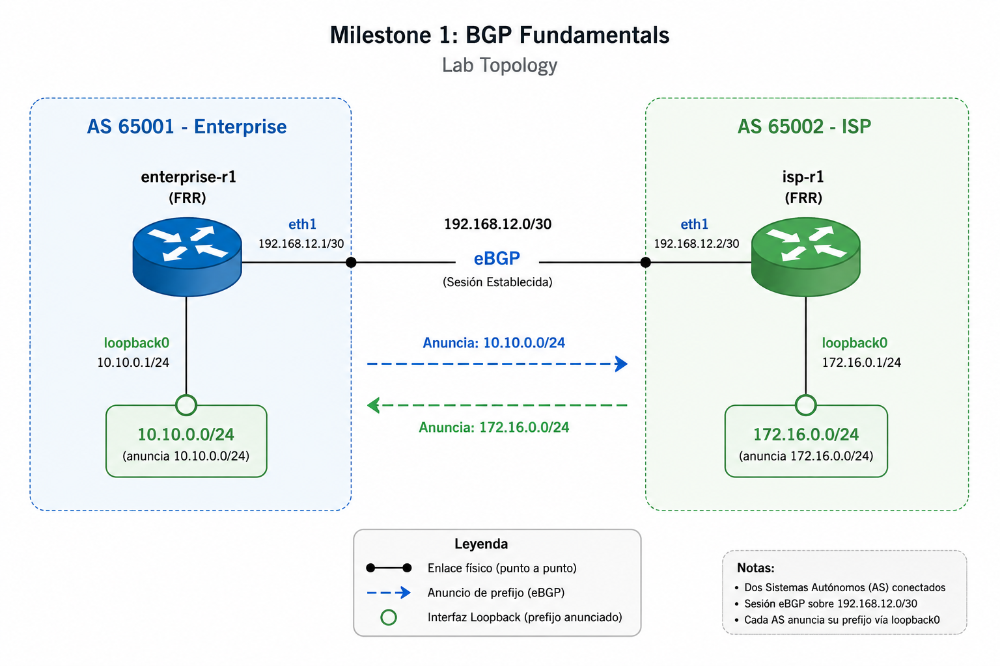
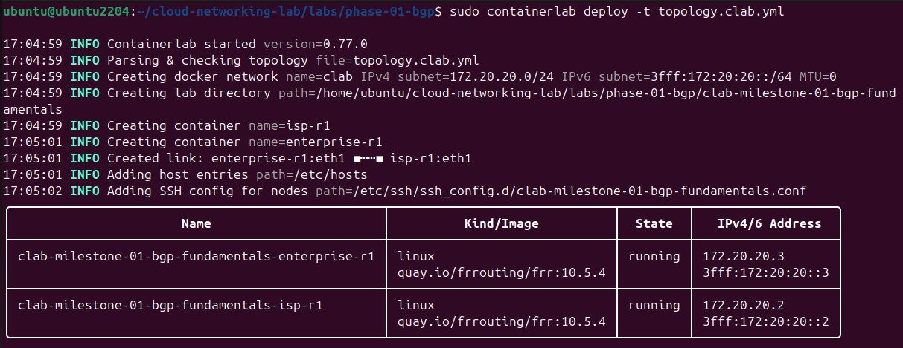
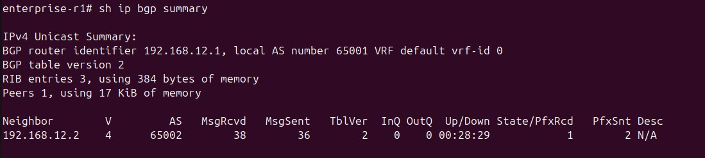
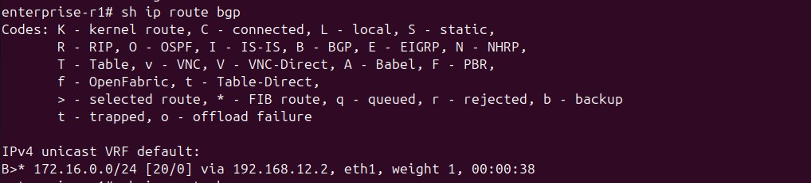
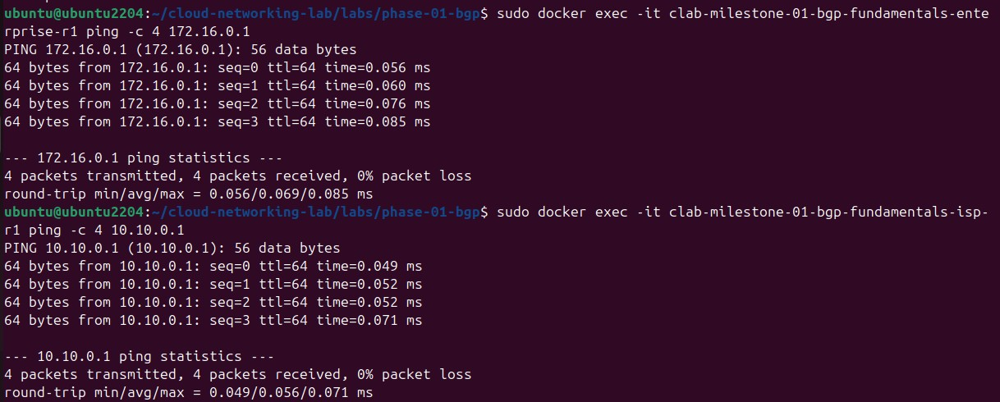

# Phase 01 – Understanding Why BGP Exists

## Overview

This milestone introduces the fundamentals of Border Gateway Protocol (BGP) by building a minimal Enterprise-to-ISP topology using Containerlab and FRRouting.

Rather than focusing only on configuration, the objective of this lab is to understand why BGP exists, which problems it solves, and how it is used in modern cloud and hybrid networking environments.

This lab serves as the foundation for future milestones involving multi-homing, route policies, AWS Direct Connect, Azure ExpressRoute, and hybrid connectivity.

---

## Objectives

- Understand why BGP exists.
- Learn the concept of Autonomous Systems (AS).
- Configure an eBGP peering between two organizations.
- Advertise and receive IPv4 prefixes.
- Validate route exchange and end-to-end connectivity.
- Build the first reproducible network topology using Containerlab.

---

## Topology

### Network Diagram

### Architecture

| Device | ASN | Interface | IP Address |
|---------|-----|-----------|------------|
| enterprise-r1 | AS65001 | eth1 | 192.168.12.1/30 |
| enterprise-r1 | AS65001 | loopback0 | 10.10.0.1/24 |
| isp-r1 | AS65002 | eth1 | 192.168.12.2/30 |
| isp-r1 | AS65002 | loopback0 | 172.16.0.1/24 |

The loopback interfaces simulate the prefixes originated by each Autonomous System.

---

## Validation

### Containerlab Deployment

The topology was successfully deployed using Containerlab.

> **Note:** The IP addresses `172.20.20.2` and `172.20.20.3` shown above are **management IP addresses** automatically assigned by Docker to the containers. They are **not** part of the BGP topology and are used only for container management and connectivity.

---

### BGP Session Established

The eBGP session successfully reached the **Established** state, confirming that both routers formed a neighbor relationship and exchanged routing information.

---

### BGP Routing Table

Each router successfully learned the remote prefix through BGP, confirming that route advertisement and installation into the routing table were successful.

---

### End-to-End Connectivity

A successful ICMP test between the loopback interfaces confirms end-to-end connectivity across both Autonomous Systems.

## Engineering Log

This milestone involved several real troubleshooting scenarios that helped deepen my understanding of Containerlab, Docker, Linux, and FRRouting.

- **FRR image source:** The official FRRouting images have moved from Docker Hub to Quay.io. The lab uses a pinned version (`quay.io/frrouting/frr:10.5.4`) to ensure reproducibility.

- **Docker permissions:** Docker access was configured correctly by adding the user to the `docker` group instead of relying on `sudo`.

- **Infrastructure as Code:** BGP daemons are enabled through version-controlled configuration files mounted by Containerlab instead of modifying running containers.

- **Container behavior:** Restarting the main process inside the container caused the entire container to restart, reinforcing the importance of declarative infrastructure.

- **Loopback interfaces:** FRRouting can configure interfaces but cannot create them. The interfaces had to be created at the Linux kernel level before FRR could manage them.

- **BGP policies:** Although the BGP session reached the *Established* state, routes were not exchanged until an explicit routing policy was configured.

- **Configuration persistence:** Runtime configuration differs from persistent configuration. Future milestones will migrate toward a fully declarative deployment.

- **Design decision:** Loopback interfaces represent the prefixes originated by each AS. A future milestone will replace them with an internal LAN learned through OSPF and redistributed into BGP.

---

## Next Steps

The next milestone will build on this foundation by exploring how BGP selects the best path when multiple routes are available. Future iterations will gradually evolve this topology into a production-like enterprise network capable of simulating cloud and hybrid networking scenarios.

## Lab Environment

| Component | Version |
|----------|---------|
| Ubuntu | 22.04 LTS |
| Containerlab | 0.77.0 |
| FRRouting | 10.5.4 |
| Docker | Latest stable |