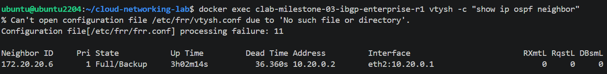
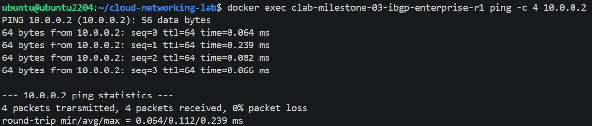
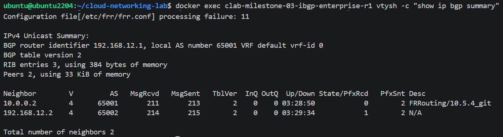
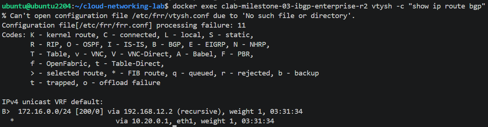
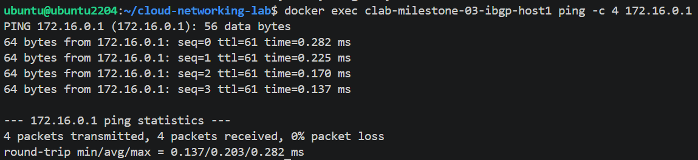

# Phase 3 — iBGP

## Overview

Phase 3 extends the enterprise network architecture from Phase 2 by introducing iBGP within the Enterprise Autonomous System (AS65001).

In the previous phase, `enterprise-r1` acted as the Enterprise edge router, learning the internal LAN through OSPF and advertising the `10.10.0.0/24` prefix to the ISP through eBGP. Phase 3 introduces a second internal router, `enterprise-r2`, which has no direct connection to the ISP.

The objective is to demonstrate that an internal router can reach external networks by learning external routes through iBGP from the Enterprise edge router, while OSPF continues to provide internal reachability between the routers.

The iBGP session is established between the loopback interfaces of `enterprise-r1` and `enterprise-r2`, both operating within AS65001.

Multi-Homing is not part of this phase and is reserved for a future phase.

## Objectives

- Introduce iBGP within the Enterprise AS65001.
- Establish an iBGP session between internal routers using loopback interfaces.
- Use OSPF to provide underlay connectivity between the iBGP peers.
- Demonstrate the relationship between OSPF as the internal transport protocol and iBGP as the internal BGP control plane.
- Validate that an internal router without a direct ISP connection can learn external routes through iBGP.
- Validate end-to-end connectivity from an internal host to an external network.
- Maintain a reproducible multi-router topology using Containerlab and FRRouting.
- Identify and resolve routing and source address selection issues affecting end-to-end connectivity.

## Topology

The topology consists of five nodes representing an internal Enterprise network connected to an external ISP.

`host1` represents a final end-user device and is connected to `enterprise-lan1`, which provides access to the Enterprise routing domain. `enterprise-r2` acts as an internal router and establishes an iBGP session with `enterprise-r1`. The edge router `enterprise-r1` maintains the eBGP session with `isp-r1`.

The iBGP session is established between the loopbacks `10.0.0.1/32` and `10.0.0.2/32`, while OSPF provides the internal reachability required to transport the iBGP session.

The diagram distinguishes between the physical OSPF underlay in Area 0 and the logical iBGP session running between the Enterprise loopbacks. It also documents the interface addresses and link subnets used throughout the topology.

## Architecture

The Enterprise network uses AS65001 and contains two BGP routers.

`enterprise-r1` is the Enterprise edge router. It participates in OSPF, iBGP, and eBGP, and maintains the external BGP connection to `isp-r1` in AS65002.

`enterprise-r2` is an internal Enterprise router with no direct ISP connection. It participates in OSPF and iBGP and uses the iBGP session with `enterprise-r1` to learn external routes.

The iBGP session is established using the routers' loopback addresses:

- `enterprise-r1`: `10.0.0.1/32`
- `enterprise-r2`: `10.0.0.2/32`

The physical link between the two routers uses the `10.20.0.0/30` subnet and carries OSPF traffic as the internal underlay. The loopback addresses are advertised through OSPF so that each router can reach the other's iBGP endpoint.

The internal path is therefore separated into two logical functions:

- **OSPF Area 0** — provides internal IP reachability and transports the iBGP session.
- **iBGP within AS65001** — distributes BGP routing information between Enterprise routers.

The external connection remains an eBGP session between `enterprise-r1` in AS65001 and `isp-r1` in AS65002.

The ISP loopback `172.16.0.1/24` represents an external network block rather than a single host address.

A real `host1` endpoint was introduced instead of using the multi-interface `enterprise-lan1` router as the final traffic source. This provides a more realistic end-to-end test and avoids ambiguity in Linux source address selection.

## Validation

The following validations were performed:

### OSPF Adjacency

OSPF neighbor adjacency reached the Full state between `enterprise-r1` and `enterprise-r2`, confirming the underlying IGP connectivity required for the iBGP session.

### Loopback Reachability

Loopback-to-loopback reachability between `10.0.0.1` and `10.0.0.2` was successfully validated through OSPF with 0% packet loss. This confirmed the prerequisite IP connectivity required to establish the loopback-based iBGP session.

### iBGP and eBGP Sessions

The BGP summary on `enterprise-r1` shows both BGP sessions in the Established state:

- eBGP session with `isp-r1` at `192.168.12.2`.
- iBGP session with `enterprise-r2` at `10.0.0.2`.

This confirms that `enterprise-r1` is simultaneously operating as the Enterprise edge router toward the ISP and as an internal BGP peer within AS65001.

### External Route Learned via iBGP

`enterprise-r2` has no direct eBGP session with the ISP, yet its BGP table contains the `172.16.0.0/24` external prefix learned through iBGP.

The route uses `enterprise-r1` as the recursive next hop, confirming the core objective of this phase: an internal Enterprise router can learn external BGP routes through iBGP without maintaining a direct eBGP connection to the ISP.

### End-to-End Connectivity

End-to-end connectivity was validated from `host1` to the simulated ISP network at `172.16.0.1`.

The test completed with 0% packet loss without requiring the source IP to be manually specified.

This confirmed that traffic could traverse the complete path:

`host1 → enterprise-lan1 → enterprise-r2 → enterprise-r1 → isp-r1`

The result validates the combined operation of the internal OSPF underlay, iBGP session, external eBGP connection, and end-to-end forwarding path.

### Reproducibility

The complete lab was successfully destroyed and redeployed using Containerlab.

The topology was also redeployed successfully after the phase directory and topology name were renamed from `phase-03-ibgp-multihoming` / `milestone-03-ibgp-multihoming` to `phase-03-ibgp` / `milestone-03-ibgp`.

This confirmed that the final architecture can be reconstructed without manual configuration steps.

## Engineering Log

Phase 3 introduced several issues that required investigation and architectural adjustments.

### Point-to-Point Addressing Conflict

The initial design assigned the same address space used by the Enterprise LAN to the point-to-point link between `enterprise-r2` and `enterprise-lan1`. This also resulted in a duplicated IP address.

The design was corrected before deployment by assigning the dedicated `10.20.1.0/30` subnet to the point-to-point link.

This reinforced the need to validate addressing plans before applying configurations.

### Containerlab Management Route

Containerlab's management network introduced a default route through `eth0` using the `172.20.20.1` gateway. This competed with the routing information required by the actual lab topology.

The issue affected the routers that had not yet been corrected from the previous phase.

The management default route was removed through an `exec` block in `topology.clab.yml`:

`ip route del default via 172.20.20.1 dev eth0`

The change was applied to the relevant nodes and required a complete destroy and deploy cycle. Individual container restarts or hot configuration changes were not sufficient because Containerlab virtual links are tied to the deployed topology.

### FRR Configuration Processing Message

During deployment, FRR reported:

`Configuration file[/etc/frr/frr.conf] processing failure: 11`

The message was investigated and determined to be benign in this lab environment. The underlying issue was related to the absence of `vtysh.conf` and did not prevent the actual `frr.conf` configuration from being loaded.

The running configuration was compared using `show running-config` to confirm that the expected FRR configuration was active.

### Kernel Source Address Selection

An end-to-end connectivity test initially failed even though the OSPF and BGP control planes appeared to be operational.

The issue was related to Linux automatically selecting a source address from a multi-interface router. The selected address was not redistributed toward the ISP, resulting in an unreachable return path.

This was conceptually similar to the source address selection issue identified in Phase 2, but occurred in a different topology context.

### Architectural Improvement: Real End Host

Rather than relying only on a manual source-address selection workaround, the topology was redesigned to include `host1`, an Alpine Linux node with a single network interface.

The previous dummy `lan0` interface was replaced by a real link between `host1` and `enterprise-lan1`.

This change removed the source-address ambiguity at the traffic origin and provided a more realistic representation of an end-user device.

The final end-to-end test from `host1` to the ISP network completed successfully without forcing a source address.

## Next Steps

The next phase will extend the Enterprise edge architecture by introducing Multi-Homing.

The planned architecture includes:

- A second ISP router.
- A second eBGP session from the Enterprise edge.
- Local Preference policies to define a preferred and backup ISP path.
- Failover validation by disabling the primary external path.
- Verification that traffic switches to the secondary ISP path.

This will build upon the iBGP architecture established in Phase 3 and introduce path selection and redundancy within the Enterprise network.

## Lab Environment

| Component | Technology |
|---|---|
| Network Emulation | Containerlab |
| Routing Platform | FRRouting (FRR) |
| Internal Routing | OSPF Area 0 |
| Internal BGP | iBGP |
| External BGP | eBGP |
| End Host | Alpine Linux |
| Container Runtime | Docker |
| Topology Definition | Containerlab YAML |
| Diagram | SVG / Draw.io / TopoViewer |
| Version Control | Git / GitHub |