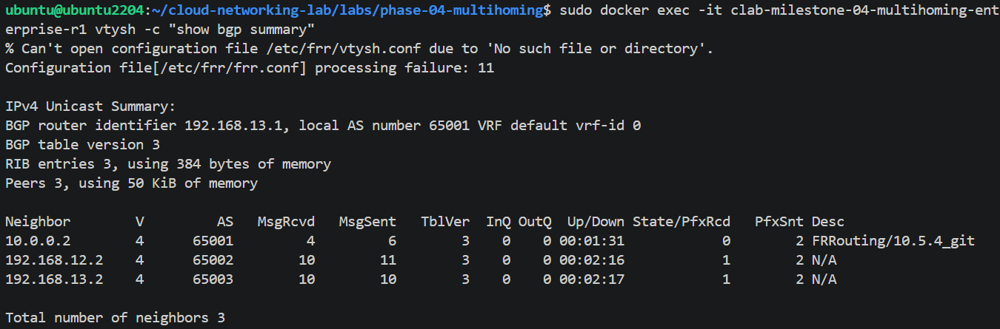
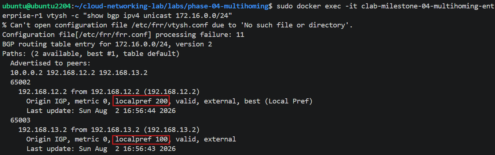
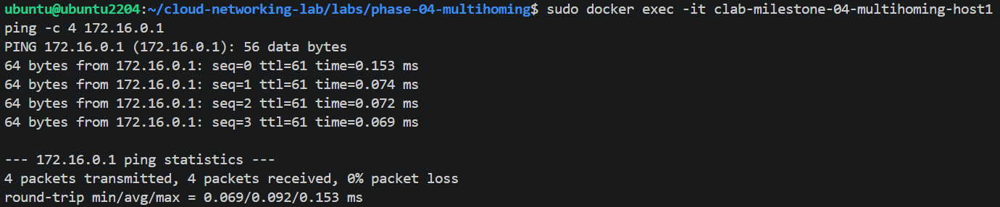
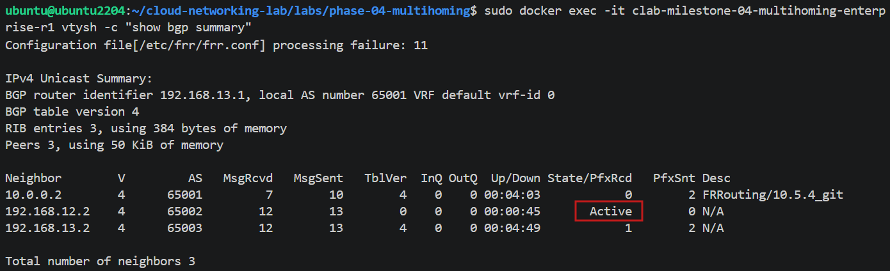
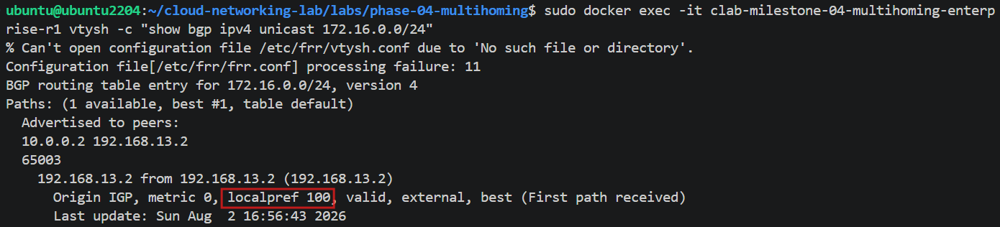
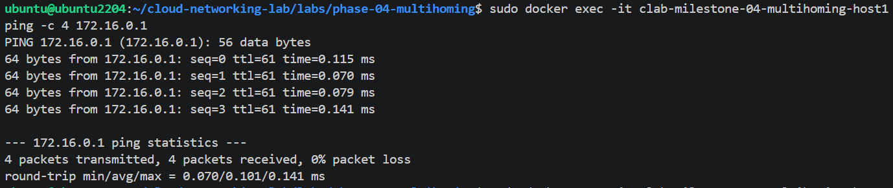

# Phase 4 — BGP Multi-Homing & Failover

## Overview

This phase extends the iBGP architecture introduced in Phase 3 by implementing a multi-homed enterprise network with redundant external BGP connectivity.

The enterprise network is connected to two external ISPs. `isp-r1` operates as the primary external path, while `isp-r2` provides a secondary path for redundancy.

BGP Local Preference is used to influence the preferred outbound path. Under normal operation, traffic exits through `isp-r1`. When the primary path becomes unavailable, BGP withdraws the corresponding route and traffic automatically converges toward `isp-r2`.

The phase focuses on understanding BGP path selection, redundant connectivity, route withdrawal, and failover behavior.

## Objectives

- Extend the Phase 3 iBGP architecture with redundant external BGP connectivity.
- Implement a multi-homed enterprise network.
- Establish iBGP connectivity within the enterprise AS.
- Establish eBGP sessions with two external ISPs.
- Use BGP Local Preference to select the preferred outbound path.
- Validate normal operation with `isp-r1` as the primary path.
- Simulate the failure of the primary external path.
- Validate BGP convergence toward the secondary ISP.
- Verify end-to-end connectivity before and after failover.

## Topology

### Normal Operation

**Normal state:** Both ISPs are active. The enterprise network uses `isp-r1` as the primary outbound path, selected by BGP Local Preference.

### Failover Operation

**Failure state:** `isp-r1` is unavailable, with the failed link marked in the topology. The enterprise network automatically switches to `isp-r2` as the remaining available external path.

## Architecture

The architecture builds on the OSPF and iBGP design introduced in Phase 3.

OSPF provides internal reachability between enterprise routers and the loopback addresses used for iBGP peering. The enterprise routers operate within the same autonomous system and exchange externally learned routes through iBGP.

The enterprise network is multi-homed to two external ISPs:

- `isp-r1` — Primary external path.
- `isp-r2` — Secondary external path.

BGP Local Preference is used to influence outbound path selection:

- `isp-r1` — Local Preference `200`
- `isp-r2` — Local Preference `100`

As a result, BGP selects the route learned through `isp-r1` under normal operating conditions.

When the `isp-r1` path becomes unavailable, the corresponding BGP route is no longer available. BGP then selects the route through `isp-r2`, which becomes the active outbound path.

The architecture separates the responsibilities of the routing protocols:

- **OSPF** provides internal reachability and the underlay for iBGP.
- **iBGP** distributes external routes within the enterprise AS.
- **eBGP** provides connectivity between the enterprise AS and the two external ISPs.
- **Local Preference** influences the preferred outbound path.
- **BGP convergence** allows traffic to transition to the secondary path when the primary path fails.

## Validation

Validation was performed in two operational states: normal operation and failover.

### Normal Operation

#### BGP Session State

All three BGP sessions are established:

- One iBGP session between the enterprise routers.
- One eBGP session with `isp-r1`.
- One eBGP session with `isp-r2`.

This confirms that the enterprise network has active connectivity to both external ISPs before the failure is introduced.

#### BGP Best Path Selection

BGP selects the route learned through `isp-r1` as the best path based on Local Preference.

The configured Local Preference values are:

- `isp-r1`: `200`
- `isp-r2`: `100`

The higher Local Preference assigned to the `isp-r1` path makes it the preferred outbound route under normal operating conditions.

#### End-to-End Connectivity

The ping from `host1` toward the simulated Internet is successful, with traffic leaving the enterprise network through the primary `isp-r1` path.

### Failover Operation

#### BGP Session State After Failure

The BGP session with `isp-r1` is no longer established and is shown in the `Active` state, while the session with `isp-r2` remains `Established`.

This confirms that the primary external path has failed while the secondary BGP connection remains operational.

#### BGP Best Path After Failure

After the failure of the `isp-r1` path, only the route learned through `isp-r2` remains available.

BGP therefore selects the `isp-r2` route as the best and only available path.

#### End-to-End Connectivity After Failover

The ping from `host1` toward the simulated Internet continues successfully after the primary path failure.

No packet loss is observed during the validation, confirming that traffic successfully transitioned to the `isp-r2` path and that connectivity was maintained after failover.

## Engineering Log

The main engineering focus of this phase was understanding how BGP can provide redundant external connectivity and influence outbound traffic using Local Preference.

The architecture was extended from the single external path used in previous phases to a multi-homed design with two external ISPs. The two paths were intentionally configured with different Local Preference values to establish a primary and secondary path.

Under normal conditions, BGP selected `isp-r1` because its route had a higher Local Preference of `200`, compared with `100` for the route learned through `isp-r2`.

The failover scenario was then introduced by taking the `isp-r1` path offline. The BGP session with `isp-r1` transitioned to `Active`, while the session with `isp-r2` remained established.

With the primary route no longer available, BGP selected the route through `isp-r2`. End-to-end connectivity remained operational, confirming that the routing control plane converged toward the secondary path and that the data plane continued forwarding traffic.

This phase reinforced the distinction between:

- **Path preference**, where BGP selects the preferred route while multiple paths are available.
- **Path redundancy**, where a secondary route remains available if the preferred path fails.
- **Failover**, where the loss of the primary path causes BGP to select the remaining available route.

The validation was performed both before and after the failure to confirm the complete behavior of the multi-homed architecture.

## Next Steps

The next phase will continue extending the lab toward more advanced cloud networking scenarios.

Future work may include:

- Reproducing the multi-homed architecture using Infrastructure as Code.
- Extending the topology toward hybrid cloud connectivity.
- Exploring redundant connectivity between the enterprise environment and a public cloud.
- Applying BGP concepts to cloud networking services and architectures.

## Lab Environment

- **Container platform:** Containerlab
- **Routing software:** FRRouting (FRR)
- **Routing protocols:** OSPF, iBGP, eBGP
- **BGP policy:** Local Preference
- **Container image:** `quay.io/frrouting/frr:10.5.4`
- **Configuration:** YAML-based Containerlab topology and FRR configuration
- **Validation:** BGP session state, BGP best-path selection, route availability, failover, and end-to-end connectivity

### Evidence Files

#### Topology Diagrams

- `topology-multihoming-normal.svg`
- `topology-multihoming-failover.svg`

#### Before Failover

- `01-bgp-summary-antes.png`
- `02-bgp-bestpath-antes.png`
- `03-ping-antes.png`

#### After Failover

- `04-bgp-summary-despues.png`
- `05-bgp-bestpath-despues.png`
- `06-ping-despues.png`